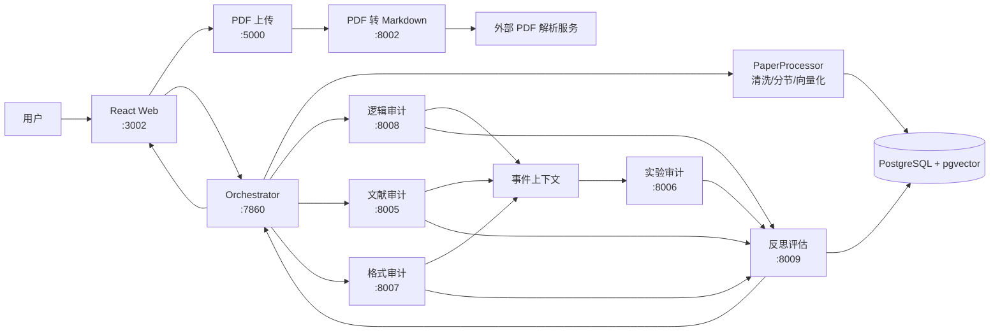
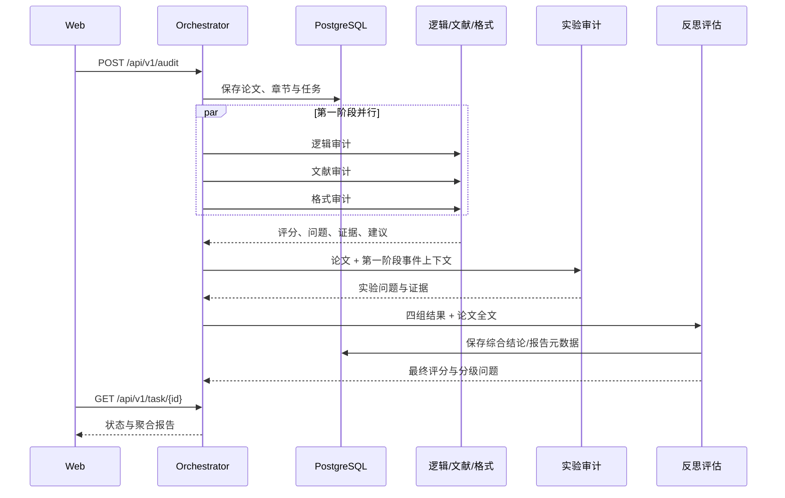

# 现状架构

本文按当前 `app/` 源码记录系统的实际状态，不把立项设想当作已实现能力。

## 1. 总体架构

当前主链路为：上传 PDF -> 转 Markdown -> 调度器落库与分节 -> 第一阶段并行运行逻辑/文献/格式审计 -> 通过进程内事件总线把结果上下文交给实验审计 -> 汇总四组结果 -> 调用反思评估 -> 前端轮询任务并展示/下载报告。

## 2. 组件清单

| 组件 | 目录 | 技术与职责 | 默认端口 |
|---|---|---|---:|
| Web 前端 | `app/website` | React 19、Ant Design、Axios；上传、服务健康检查、任务进度、评分矩阵和报告展示 | 3002 |
| 上传服务 | `app/pdf_api` | FastAPI；接收 PDF 并保存临时文件 | 5000 |
| 转换服务 | `app/pdf_to_md` | FastAPI、MinerU 本地 pipeline；输出 Markdown、content_list.json 和 layout.pdf | 8002 |
| 调度器 | `app/orchestrator` | FastAPI、HTTPX；任务管理、分阶段 Agent 编排、事件总线、重试和结果聚合 | 7860 |
| 逻辑审计 | `app/audit_logic` | 规则、命题切分、语义图与一致性检查 | 8008 |
| 文献审计 | `app/audit_citation` | 引文抽取、真实性/相关性/时效性检查，可选搜索与 LLM | 8005 |
| 格式审计 | `app/audit_format` | PyMuPDF 版面分析、规则引擎和可选 LLM 语义检查 | 8007 |
| 实验审计 | `app/audit_experiment` | 实验设计、显著性、离散度、图文一致性、基线和数据泄漏规则 | 8006 |
| 反思评估 | `app/audit_reflection` | 去重、证据验证、优先级排序、冲突消解、综合评分和 Markdown 报告 | 8009 |
| 数据库 | 外部 PostgreSQL | 论文、章节、向量、规则、Agent 结果、调度任务和最终结论 | 5432 |

`app/audit_code` 是代码片段审计试验模块，`app/paper_review_api` 是联调用 Mock API，二者当前未进入四 Agent 主链路。

## 3. 调度与数据流

调度器的 `NanobotWorkflowRunner` 提供兼容式工作流抽象。若安装 `nanobot` 包会标记对应后端，否则使用内置实现；当前关键编排逻辑仍由本项目代码完成。

主要持久化对象包括 `papers`、`paper_sections`、`main_rules`、Agent 审计结果、反思结论和 `orchestrator_tasks`。数据库表在不同历史模块中存在命名差异，需要在结题版迁移为单一 schema。

## 4. 已实现能力

- PDF 上传、转换、Markdown 测试模式和前端完整交互已打通。
- 四类审计服务具备独立 HTTP API、健康检查和结构化 JSON 返回。
- 调度器支持后台任务、状态轮询、分阶段并发、失败重试、事件上下文和 PostgreSQL 任务持久化。
- 格式/逻辑/实验模块已有规则引擎，反思模块已有去重、证据验证、冲突裁决、人工复核标记和报告生成能力。
- 具备部分单元测试、回归样本、模块 README 和启动脚本。

## 5. 与立项要求的主要差距

1. **数据集未闭环**：仓库没有可验收的 1000 份数据清单、300 份高质量标注、标注协议、脱敏记录和 Kappa 统计。
2. **强化学习未落地**：当前主要是规则、固定权重、LLM/RAG 和事件编排，没有可复现的策略训练、奖励定义、训练曲线或消融实验。
3. **RAG 不完整**：已有向量化和数据库结构，但缺少统一知识库构建、检索评测与引用到证据的稳定协议。
4. **实验验证不足**：缺少 SVM + TF-IDF、纯 LLM 等基线的统一测试集结果，也缺少显著性检验、误差分析和耗时统计。
5. **工程配置分散**：历史模块使用 `DB_*`、`POSTGRES_*`、`EXPERT_DB_*` 多套变量；数据库表名和结果协议也不完全一致。
6. **部署不可一键复现**：尚无全系统 Docker Compose、数据库迁移、CI 和固定模型版本；MinerU 本地模型依赖较重，需要在目标机预下载模型。
7. **安全与治理缺失**：无用户身份认证、角色权限、论文加密、脱敏审计和自动清理策略，不适合直接处理真实学位论文。
8. **文档存在历史副本**：`app/audit_reflection` 等目录保留了组内阶段文档和重复实现，结题版需要冻结唯一入口与接口契约。
