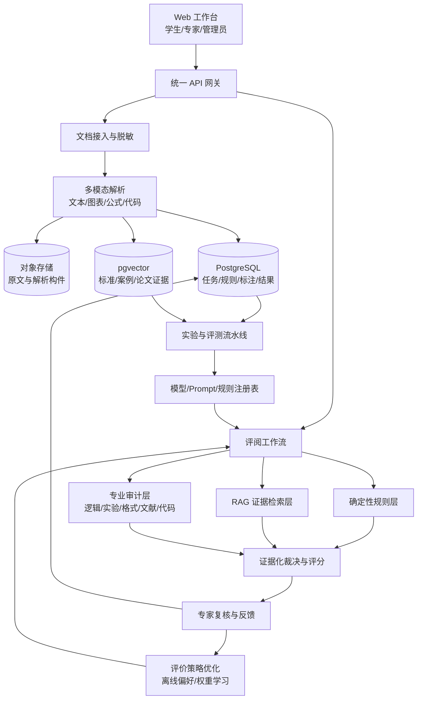

# 结题目标架构与实施设计

## 1. 设计原则

结题版不再继续扩张微服务数量，而是围绕“可验证、可解释、可复现”收敛现有原型。优先完成立项书明确承诺的数据、算法对比和验收证据，再做界面与模型复杂度优化。

目标系统应满足：

- 同一论文、同一配置和同一模型版本可重复得到可比较结果。
- 每个扣分项包含评价维度、规则/模型版本、原文位置、证据片段、置信度和修改建议。
- 自动结论可被专家接受、修改或驳回，所有动作形成审计记录和训练反馈。
- 任何实验数字都能追溯到固定数据划分、代码版本、配置和原始输出。

## 2. 目标架构



建议把现有服务按三个部署单元收敛：

1. `web`：保留 React 工作台，增加专家复核、实验看板与结果导出。
2. `api`：合并上传、解析代理、调度和报告 API，保留内部模块边界，减少端口与配置漂移。
3. `worker`：把四类审计与反思评估作为可重试任务执行器；用任务队列或数据库队列替代进程内状态。

结题时间有限时，不要求立即完成物理合并；但必须统一 API Schema、配置、数据库迁移和启动方式。

## 3. 数据与标注设计

### 3.1 数据清单

为每篇论文建立不可变 `paper_id` 和数据卡：来源授权、学科/方向、年份、页数、是否含代码/图表、评阅意见数量、脱敏状态、解析质量、标注状态和数据划分。原始 PDF 不进入公开仓库，只提交脱敏样例、字段规范、哈希清单和获取说明。

### 3.2 标注单元

统一标注对象为：

```json
{
  "paper_id": "uuid",
  "dimension": "experiment.reproducibility",
  "label": "major_issue",
  "score": 62,
  "evidence": [{"section": "4.2", "start": 120, "end": 188}],
  "comment": "缺少随机种子与重复次数",
  "annotator_id": "expert-03",
  "review_status": "adjudicated"
}
```

至少两名标注者独立标注核心样本，分歧由第三人裁决。按维度报告 Kappa，不只报告总平均；低于 0.85 的维度必须修订指南并重标。

### 3.3 数据划分

- 训练/验证/测试按 7:2:1 固定，按研究方向、年份和质量等级分层。
- 同一作者、同一课题或高度相似版本不得跨集合，避免泄漏。
- 测试集在模型与 Prompt 冻结前不可查看标签。
- 提交 `dataset_manifest.csv`、脱敏脚本、标注指南、Kappa 计算脚本和数据卡；真实论文通过受控存储提供。

## 4. 评价引擎设计

### 4.1 三层评价

1. **确定性规则层**：页码、章节比例、引用数量/年份、图表引用、统计要素等可验证指标，输出规则 ID 和精确证据。
2. **RAG + LLM 层**：检索评价标准、相似专家案例和论文原文片段，用结构化输出评价语义、创新性与论证质量。
3. **裁决层**：对规则与 Agent 结论去重、检查证据是否来自原文、校准严重性和置信度，触发人工复核。

所有模块采用统一 `Finding` 契约：`finding_id`、`dimension`、`severity`、`score_delta`、`evidence`、`rationale`、`suggestion`、`confidence`、`producer`、`version`。

### 4.2 评价策略优化

立项书承诺了强化学习，结题版应给出可运行而非口号式实现。建议采用风险较低的两步方案：

1. 以专家“接受/修改/驳回”及分项评分差作为奖励，训练维度权重或排序策略；静态专家权重作为基线。
2. 数据足够时使用离线偏好优化或上下文 bandit 选择 Prompt/检索参数；只有在奖励稳定、样本规模足够时再做 PPO/DPO。

必须记录状态、动作、奖励、策略版本和随机种子，并做“无策略优化 / 固定权重 / 学习策略”消融。若数据不足以支持 PPO，应如实把成果表述为“离线评价策略优化”，不要把固定权重包装成强化学习。

## 5. 实验设计

### 5.1 对比方法

- `B0`：SVM + TF-IDF 传统基线。
- `B1`：纯大模型单次 Prompt，无 RAG、无规则。
- `B2`：规则 + LLM，无专家案例检索。
- `B3`：规则 + RAG + 多 Agent，无策略优化。
- `Ours`：完整系统，含证据裁决和评价策略优化。

### 5.2 指标

| 类型 | 指标 | 建议验收值 |
|---|---|---:|
| 分项判断 | Accuracy、Macro-F1 | 相对最佳基线显著提升，并报告 95% CI |
| 专家一致性 | 二次加权 Kappa / Spearman | Kappa >= 0.75；标注一致性 Kappa >= 0.85 |
| 评语语义 | BERTScore 或固定嵌入余弦相似度 | >= 0.85，明确模型与计算方法 |
| 证据可靠性 | Evidence precision / grounding rate | >= 0.90 |
| 建议可用性 | 专家 1-5 分量表 | 平均 >= 4.0 |
| 效率 | 单篇端到端 P50/P95 | P95 <= 5 分钟 |
| 稳定性 | 成功率、重试率 | 成功率 >= 95% |

所有指标按论文级 bootstrap 计算置信区间。对分类结果使用 McNemar 或 bootstrap 检验，对专家量表报告效应量，禁止只报单次最好结果。

### 5.3 消融与误差分析

至少移除 RAG、规则层、反思裁决、策略优化各做一组消融。再按论文方向、长度、年份、图表密度和质量等级切片，检查偏差与失败类型。选取成功、一般、失败案例各 3 篇做证据链展示。

## 6. 工程与安全设计

- 使用单一 `app/.env`、Pydantic Settings 和统一变量名；敏感值由部署环境注入。
- 使用 Alembic 或 SQL 迁移管理 PostgreSQL/pgvector schema，禁止服务自行创建冲突表。
- 增加 Docker Compose，固定 Python/Node/模型版本，提供一条命令启动数据库、API、worker 和 Web。
- 增加任务幂等键、超时、重试、结构化日志、trace ID、失败任务重放和健康检查。
- 增加登录、角色权限、文件大小/类型检查、恶意文档隔离、传输与静态加密、自动删除期限和操作审计。
- CI 至少执行 Python 单元测试、API 契约测试、前端构建、密钥扫描和最小端到端样例。

## 7. 实施顺序

### P0：两周内冻结结题基线

- 冻结评价维度、统一 `Finding`/任务协议、数据库 schema 和配置。
- 建立 50 篇可复现实验小集，先打通标注、评测和报告流水线。
- 提供 Docker Compose 或等价一键部署，保证第三方可运行。

### P1：数据与实验主线

- 扩展到 300 篇双人高质量标注并达到 Kappa 目标，再推进到 1000 篇清单。
- 实现五组对比、四组消融、置信区间和误差分析。
- 实现专家复核界面与反馈记录，完成离线评价策略优化。

### P2：结题封版

- 固定测试集、模型、Prompt、规则、镜像和版本标签。
- 完成需求、设计、数据库、接口、测试、部署、用户手册、数据卡和模型卡。
- 准备 3 个离线演示样例与降级模式，确保答辩现场不依赖公网大模型。

## 8. 结题演示脚本

1. 上传一篇脱敏论文，展示解析出的章节、图表、公式和代码片段。
2. 启动评阅，展示四个维度的进度、trace ID 和规则/模型版本。
3. 打开一个问题，展示原文定位、评价标准、相似专家案例、置信度和建议。
4. 由专家接受或修改结论，展示反馈如何进入策略数据。
5. 展示同一测试集上的基线对比、消融、Kappa、证据准确率和 P95 耗时。
6. 断网运行固定样例，证明系统构件可用、功能完整、结果可复现。
