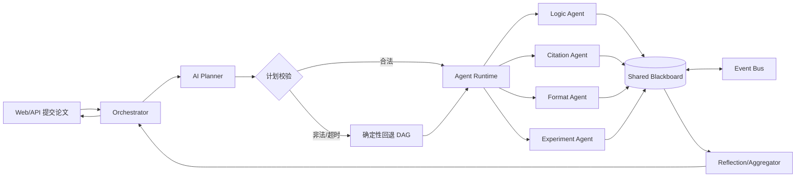

# AI 调度与多智能体协作设计

本文是当前代码实现对应的结题设计。原有 `NanobotWorkflowRunner` 的固定阶段已替换为“AI Planner + 受约束运行时”；旧 Agent HTTP 接口保持兼容。

## 1. 总体架构



Planner 只负责提出任务图，程序仍然掌握执行权。它不能创建 URL、调用工具或输出代码；只能选择注册表里的 Agent，并填写目标、依赖、是否必需和有限重试次数。

## 2. 代码模块

| 模块 | 职责 |
|---|---|
| `app/orchestrator/agent_registry.py` | Agent 名称、能力、端点、超时、成本、可咨询对象白名单 |
| `app/orchestrator/planner.py` | OpenAI-compatible LLM 调用、严格 JSON 解析、白名单校验、拓扑排序、回退计划 |
| `app/orchestrator/blackboard.py` | 按请求隔离的 finding、证据、开放问题、咨询和决策，只允许追加 |
| `app/orchestrator/agent_runtime.py` | DAG 并发、依赖等待、重试、结构化咨询任务、黑板/事件发布 |
| `app/orchestrator/nanobot_workflow.py` | 对现有调度器提供统一入口，合并聚合报告和反思结果 |
| `app/orchestrator/paper_dataset.py` | 扫描 `papers/<id>/paper.pdf` 与 `reviews/review-*.pdf`，生成 manifest |
| `app/scripts/build_paper_manifest.py` | 一次性构建 JSONL 数据清单，不把 PDF 内容复制进仓库 |

## 3. AI Planner 契约

Planner 输出示例：

```json
{
  "goal": "review_paper",
  "tasks": [
    {
      "task_id": "logic-1",
      "agent": "logic_agent",
      "objective": "检查论证链、矛盾和逻辑跳跃",
      "depends_on": [],
      "required": true,
      "max_retries": 1
    },
    {
      "task_id": "experiment-1",
      "agent": "experiment_agent",
      "objective": "检查实验设计、统计有效性和可复现性",
      "depends_on": ["logic-1"],
      "required": true,
      "max_retries": 1
    }
  ],
  "consultation_rounds": 2,
  "stop_condition": {"min_required_agents": 2, "max_rounds": 3}
}
```

校验规则：Agent 必须注册；任务 ID 唯一且符合字符集；依赖必须存在；禁止自依赖和循环；默认最多 12 个任务、3 轮咨询、每任务最多 3 次重试。校验失败、无 API Key、请求超时或 LLM 输出非 JSON 时使用确定性回退计划（逻辑、文献、格式并行，实验依赖前三者）。

## 4. Agent 交流协议

现有 Agent 请求体保留 `paper_id`、`content` 等字段，并在 `interaction_context` 增加：

```json
{
  "request_id": "audit_xxx",
  "paper_id": "uuid",
  "consumer_agent": "experiment_agent",
  "planner_task": {"task_id": "experiment-1", "objective": "..."},
  "blackboard": {
    "agent_findings": [],
    "open_questions": [],
    "decisions": []
  },
  "events": []
}
```

Agent 可以返回 `evidence` 和 `consultation_requests`：

```json
{
  "consultation_requests": [
    {
      "to_agent": "citation_agent",
      "topic": "claim_support",
      "question": "该结论是否有足够的文献证据？",
      "payload": {"claim": "..."}
    }
  ]
}
```

运行时检查目标白名单，创建一次性咨询任务，将回答写回黑板并发布 `agent.consultation_response` 事件。Agent 不能直接覆盖其他 Agent 的 finding；每条记录含 `finding_id`、`task_id`、`producer`、证据和时间戳。

## 5. 一次任务的时序

1. Orchestrator 保存论文，生成 `paper_id` 和 `request_id`。
2. Planner 读取标题、内容片段和 Agent 能力，生成并校验计划。
3. Runtime 找出入度为零的任务并发执行；依赖完成后解锁下一批任务。
4. 每次成功/失败都写入黑板和 EventBus；后续 Agent 收到可见 finding、质询和 Planner 目标。
5. 结构化咨询在最大轮次内执行；超限直接停止扩展。
6. 聚合器只对主任务计分，咨询结果作为证据和对话轨迹保留，之后进入反思评估。
7. `GET /api/v1/task/{request_id}` 返回 `planner_status`、`plan`、`round`、`consultation_count`、`scheduler_backend` 和最终报告。

## 6. `papers` 数据集接入

当前数据集约 1347 个论文目录、4048 个 PDF。目录约定：

```text
papers/<sample-id>/paper.pdf
papers/<sample-id>/reviews/review-01.pdf
papers/<sample-id>/reviews/review-02.pdf
```

运行：

```bash
python app/scripts/build_paper_manifest.py \
  --root papers \
  --output papers/manifest.jsonl
```

manifest 为 JSONL，每行包含 `paper_id`、相对路径、论文 SHA-256、大小、页数、评语数量和固定 `train/validation/test` 划分。相同论文及其所有评语只能进入一个 split，避免数据泄漏。原始 PDF 由 `PAPERS_ROOT` 挂载并受访问控制，`.gitignore` 已阻止其进入 GitHub；公开仓库只保留脚本、数据卡和 manifest。

推荐环境变量：

```env
ENABLE_AI_SCHEDULER=true
LLM_MODEL=deepseek-chat
PAPERS_ROOT=E:/项目/大创/papers
PAPERS_MANIFEST=E:/项目/大创/papers/manifest.jsonl
DATASET_SPLIT_SEED=20260819
```

## 7. 结题验收设计

| 验收项 | 产物 | 通过条件 |
|---|---|---|
| AI 决策 | Planner prompt、原始响应、校验计划、回退日志 | 有效 JSON 生成 DAG；非法计划拒绝；无密钥可回退运行 |
| 多 Agent 交流 | 黑板快照、事件总线、咨询请求/响应 | 至少一次跨 Agent finding 可见；咨询次数受限且可追踪 |
| 稳定性 | 任务状态、重试记录、失败详情 | 单 Agent 故障不丢任务；状态可轮询、可重放 |
| 数据闭环 | `manifest.jsonl`、脱敏脚本、数据卡 | 论文/评语一一关联；split 无泄漏；原始 PDF 不提交 |
| 质量评估 | 固定测试集、基线和消融实验 | 报告 Macro-F1、Kappa、证据 grounding、P50/P95 和失败案例 |

